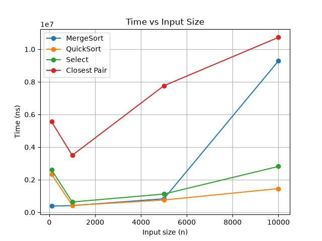
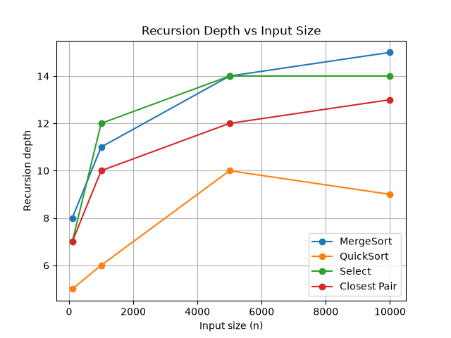

# Assignment 1 — Divide-and-Conquer Algorithm Analysis

## 1. Overview

This project implements and analyzes four divide-and-conquer algorithms:

* Merge Sort
* Randomized Quick Sort
* Deterministic Select (Median-of-Medians)
* Closest Pair of Points

The goal is to compare their theoretical complexity with practical execution time and recursion depth.

## 2. Algorithms

### 2.1 Merge Sort

Merge Sort divides the array into two smaller parts, recursively sorts them, and then merges the sorted parts.

The implementation uses one reusable auxiliary buffer for merging.

**Time complexity:**

* Best: Θ(n log n)
* Average: Θ(n log n)
* Worst: Θ(n log n)

**Space complexity:** O(n)

**Recurrence:**

T(n) = 2T(n/2) + Θ(n)

Using the Master Theorem:

a = 2, b = 2, f(n) = Θ(n)

Therefore:

T(n) = Θ(n log n)

### 2.2 Randomized Quick Sort

Quick Sort chooses a random pivot and partitions the array around it.

The implementation uses in-place partitioning. It recursively processes the smaller partition and iterates over the larger partition to keep the recursion depth relatively small.

**Time complexity:**

* Best: Θ(n log n)
* Average: Θ(n log n)
* Worst: Θ(n²)

**Space complexity:** O(log n) average recursion depth.

The random pivot helps reduce the chance of consistently unbalanced partitions.

### 2.3 Deterministic Select

Deterministic Select finds the k-th smallest element without sorting the whole array.

The implementation divides the elements into groups of five, finds the median of each group, and uses the median of these medians as the pivot.

Only the partition containing the required element is processed recursively.

**Time complexity:**

* Best: Θ(n)
* Average: Θ(n)
* Worst: Θ(n)

**Space complexity:** O(log n) recursion depth.

The main idea is to choose a pivot that guarantees sufficiently balanced partitions.

### 2.4 Closest Pair of Points

The Closest Pair algorithm finds the minimum Euclidean distance between two points.

The points are first sorted by the x-coordinate. The algorithm divides the points into two parts, solves each part recursively, and then checks points near the dividing line.

**Time complexity:**

Θ(n log n)

**Space complexity:** O(n)

The main recurrence is:

T(n) = 2T(n/2) + Θ(n)

Therefore:

T(n) = Θ(n log n)

## 3. Experimental Setup

The experiments were performed using Java and `System.nanoTime()`.

The tested input sizes were:

* 100
* 1,000
* 5,000
* 10,000

For every algorithm, execution time and maximum recursion depth were recorded.

The results were saved to:

`results/results.csv`

## 4. Experimental Results

### Execution Time and Recursion Depth

| Algorithm    |     n | Time (ns) | Recursion Depth |
| ------------ | ----: | --------: | --------------: |
| MergeSort    |   100 |    384400 |               8 |
| QuickSort    |   100 |   2333700 |               5 |
| Select       |   100 |   2600200 |               7 |
| Closest Pair |   100 |   5556600 |               7 |
| MergeSort    |  1000 |    414000 |              11 |
| QuickSort    |  1000 |    422100 |               6 |
| Select       |  1000 |    635100 |              12 |
| Closest Pair |  1000 |   3497700 |              10 |
| MergeSort    |  5000 |    831300 |              14 |
| QuickSort    |  5000 |    757500 |              10 |
| Select       |  5000 |   1122100 |              14 |
| Closest Pair |  5000 |   7763900 |              12 |
| MergeSort    | 10000 |   9284300 |              15 |
| QuickSort    | 10000 |   1457500 |               9 |
| Select       | 10000 |   2815800 |              14 |
| Closest Pair | 10000 |  10730900 |              13 |

## 5. Recursion Depth

The measured recursion depths were:

| Algorithm    | n=100 | n=1000 | n=5000 | n=10000 |
| ------------ | ----: | -----: | -----: | ------: |
| MergeSort    |     8 |     11 |     14 |      15 |
| QuickSort    |     5 |      6 |     10 |       9 |
| Select       |     7 |     12 |     14 |      14 |
| Closest Pair |     7 |     10 |     12 |      13 |

The recursion depth generally increases when the input size increases.

Merge Sort and Closest Pair show a clear logarithmic-style increase in recursion depth.

Quick Sort also remained relatively shallow because the implementation recursively processes the smaller partition and iterates over the larger one.

## 6. Graphs

### Time vs Input Size

### Recursion Depth vs Input Size

## 7. Testing

The algorithms were tested for correctness.

### Merge Sort

Merge Sort was tested using:

* random data
* sorted data
* reverse-sorted data
* duplicate values

The results were compared with Java's `Arrays.sort()`.

### Quick Sort

Quick Sort was tested using:

* random data
* sorted data
* reverse-sorted data
* duplicate values

The results were compared with `Arrays.sort()`.

### Deterministic Select

100 random tests were performed.

For every test, the result of Select was compared with the k-th element of the sorted array.

Result:

`100 random tests: true`

### Closest Pair

The result was compared with a brute-force O(n²) solution.

Test result:

`Result: 1.4142135623730951`

`Expected: 1.4142135623730951`

`Correct: true`

## 8. Discussion

### How does measured time compare with theoretical complexity?

The experimental results generally show that execution time increases as the input size increases.

Merge Sort and Closest Pair have theoretical complexity Θ(n log n), and their measured times increase as n becomes larger.

Quick Sort usually has Θ(n log n) average complexity, but its actual time depends on the randomly selected pivots.

Deterministic Select has linear theoretical complexity Θ(n), and its execution time also increases with the input size.

The exact measured times can vary between runs because of Java runtime behavior and computer system conditions.

### How does recursion depth grow?

The recursion depth generally increases with input size.

For Merge Sort, the depth grows approximately logarithmically.

For Closest Pair, the recursion also follows the divide-and-conquer structure and shows a logarithmic-style increase.

Quick Sort has relatively small recursion depth because the implementation recursively processes the smaller partition.

Deterministic Select recursively processes only the partition containing the required element.

### Which algorithm is most sensitive to input size?

The measured results show that Closest Pair and Merge Sort require more time as the input size becomes large.

Quick Sort has relatively low execution time in these experiments, although its theoretical worst case is O(n²).

### Why can practical results differ from theory?

Theoretical complexity describes how an algorithm grows with input size, but real execution time is also affected by factors such as the Java Virtual Machine, system load, memory access, and random pivot selection.

Therefore, one experiment does not give exactly the same pattern as theoretical formulas.

## 9. Reflection

This assignment helped me understand how divide-and-conquer algorithms work in practice. I implemented four different algorithms and compared their theoretical complexity with real execution time and recursion depth.

I also learned that theoretical complexity and practical performance are related but not identical. Measuring the algorithms with different input sizes helped me see how recursion depth and execution time change as the input grows. The testing part also helped me check that the implementations produce correct results.

## 10. Project Structure

assignment1-divide-and-conquer/
├── src/
├── tests/
├── docs/
│   ├── screenshots/
│   └── plots/
│       ├── time_vs_n.png
│       └── recursion_depth_vs_n.png
├── results/
│   └── results.csv
├── plot.py
├── README.md
├── pom.xml
└── .gitignore

